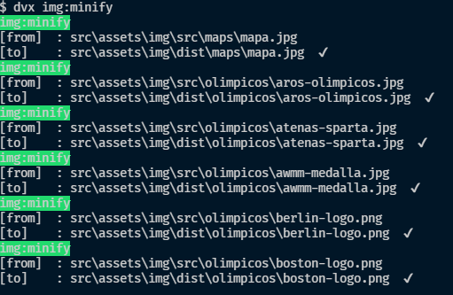
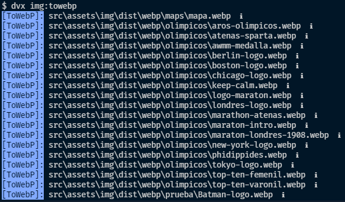
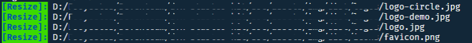
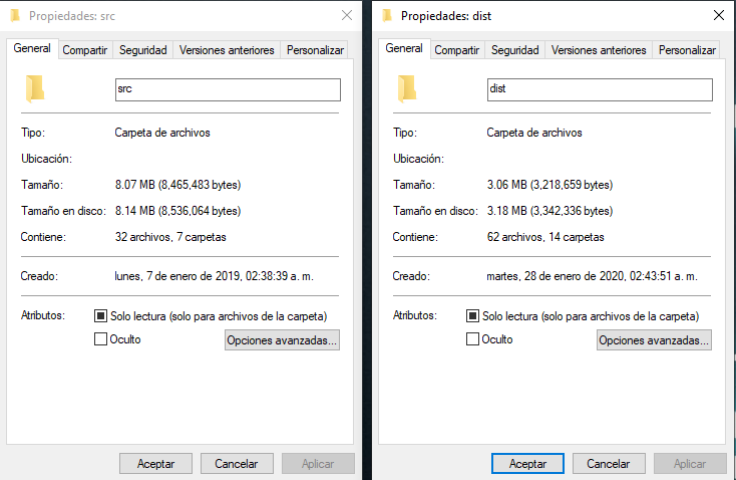
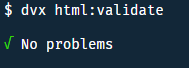
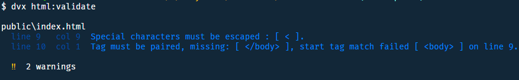

# 📝 Notes

Local test command:
```sh
  npm link
```

- Add permission: `chmod +x ./cli.js`
- Move: `mv ./cli.js /usr/bin/`
- where is?: `where dvx`
- Size on end: `du -sh ./src/img/src/`
- [Execute a command line binary with Node.JS](https://stackoverflow.com/questions/20643470/execute-a-command-line-binary-with-node-js "stackoverflow")

## Console name

- [Text to ASCII art generator](http://patorjk.com/software/taag/#p=testall&f=3D%20Diagonal&t=Devexteam%20CLI)
- Font Name: Standard
```sh
   ____                      _                          ____ _     ___
  |  _ \  _____   _______  _| |_ ___  __ _ _ __ ___    / ___| |   |_ _|
  | | | |/ _ \ \ / / _ \ \/ / __/ _ \/ _` | '_ ` _ \  | |   | |    | |
  | |_| |  __/\ V /  __/>  <| ||  __/ (_| | | | | | | | |___| |___ | |
  |____/ \___| \_/ \___/_/\_\\__\___|\__,_|_| |_| |_|  \____|_____|___|
```

## Node environment

```js
/*
 * [0] Reserved by Node.js
 * [1] Reserved by Node.js
 */
process.argv[3] = 'Estamos aprendiendo Node.JS';
process.argv[4] = 19;
process.argv[5] = null;
process.argv[6] = true;

c('----------------------------------------');
c('        PROCESOS DE NODE.JS             ');
c(`ID del proceso............${process.pid}`);
c(`Título....................${process.title}`);
c(`Directorio de Node.JS.....${process.execPath}`);
c(`Directorio actual.........${process.cwd()}`);
c(`Versión de Node.JS........${process.version}`);
c(`Versiones de dependencias.${process.versions}`);
c(`Plataforma (S.O.).........${process.platform}`);
c(`Arquitectura (S.O.).......${process.arch}`);
c(`Tiempo activo de Node.JS..${process.uptime()}`);
c(`Argumento de procesos.....${process.argv}`);
c('----------------------------------------');

for(let i in process.argv){
  c(`[${i}] - ${process.argv[i]}`);
}

c(__dirname);
c(__filename);
c(process);
c(process.cwd());
c(process.argv);
c(process.argv0);
```

## Examples TS with yargs

```ts
#!/usr/bin/env node

import yargs, { Argv } from 'yargs';

let argv = yargs
    .command('serve', "Start the server.", (yargs: Argv) => {
        return yargs.option('port', {
            describe: "Port to bind on",
            default: "5000",
        }).option('verbose', {
            alias: 'v',
            default: false,
        })
    }).argv;

if (argv.verbose) {
    console.info("Verbose mode on.");
}

serve(argv.port);

function serve(port: string) {
    console.info(`Serve on port ${port}.`);
}
```

```ts
#!/usr/bin/env node
import yargs, { Argv } from 'yargs';

const argv = yargs(process.argv.slice(2)).options({
  a: { type: 'boolean', default: false },
  b: { type: 'string', demandOption: true },
  c: { type: 'number', alias: 'chill' },
  d: { type: 'array' },
  e: { type: 'count' },
  f: { choices: ['1', '2', '3'] }
}).argv;
```

```ts
#!/usr/bin/env node
import yargs, { Argv } from 'yargs';
interface Arguments {
    [x: string]: unknown;
    a: boolean;
    b: string;
    c: number | undefined;
    d: (string | number)[] | undefined;
    e: number;
    f: string | undefined;
  }
const argv:Arguments = yargs(process.argv.slice(2)).options({
  a: { type: 'boolean', default: false },
  b: { type: 'string', demandOption: true },
  c: { type: 'number', alias: 'chill' },
  d: { type: 'array' },
  e: { type: 'count' },
  f: { choices: ['1', '2', '3'] }
}).argv;
```

```ts
#!/usr/bin/env node
import yargs, { Argv } from 'yargs';

type Difficulty = 'normal' | 'nightmare' | 'hell';
const difficulties: ReadonlyArray<Difficulty> = ['normal', 'nightmare', 'hell'];

const argv = yargs.option('difficulty', {
  choices: difficulties,
  demandOption: true
}).argv;
```


```js
import yargs from 'yargs/yargs';
import { hideBin } from 'yargs/helpers';
import { Arguments } from 'yargs';

const cli = yargs(hideBin(process.argv))
  .scriptName('dvx')
  .usage('$0 <cmd> [args]')
  .command(
    'hello [name]',
    'welcome ter yargs!',
    (yargs) => {
      yargs.positional('name', {
        type: 'string',
        default: 'Cambi',
        describe: 'the name to say hello to'
      });
    },
    function (argv) {
      console.log('hello', argv.name, 'welcome to yargs!');
    }
  )
  .command(
    'download <files...>',
    'download a list of files',
    (yargs: any) => {
      return yargs.positional('files', {
        describe: 'a list of files to do something with'
      });
    },
    (argv: Arguments) => {
      console.info(argv);
    }
  )
  .command(
    'curl <url>',
    'fetch the contents of the URL',
    () => {},
    (argv) => {
      console.info(argv);
    }
  )
  .help();

cli.argv;

console.log(cli.argv);

```
//

// args: Argv<
//   InferredOptionTypes<{
//     [key in keyof typeof HtmlValidate.builder]: typeof HtmlValidate.builder[key];
//   }>
// >;

// {
//   [key in keyof typeof HtmlValidate.builder]: InferredOptionType<typeof HtmlValidate.builder[key]>;
// }


/**
 ** Notes:
 ** dvx files:clean-sourcemaps --pkg=bootstrap-datepicker datepicker
 *
 ** We can use the command:
 * find ./node_modules/tinymce/ -regex ".*\.\(css\|css\)$" -exec sed -i -E "/\/[\*]\#\s+(sourceMappingURL\=.*\.(css)\.map)\s+[\*]\//g" {}
 *
  exec(
    `find ${dir.absolutePath} -regex ".*\\.\\(css\\)$" -exec sed -i -E "s/\\/[\\*]\\#\\s+(sourceMappingURL\\=.*\\.(css)\\.map)\\s+[\\*]\\//\\/\\*\\*\\//g" {} \;`,
    (err, stdout, stderr) => {
      if (err) {
        error('[files:clear-sourcemap-comments-from-css]:', err);
      }
      log('[files:clear-sourcemap-comments-from-css]:', package);
      // log("err: ", err);
      log('stdout: ', stdout);
      log('stderr: ', stderr);
    }
  );
 */

find . -name "*.bak" -type f
find . -name "*.bak" -type f -delete
Promise.resolve().then(() => tslib_1.__importStar(require
Promise.resolve().then(() => tslib_1.__importStar(require
Promise.resolve().then(() => tslib_1.__importStar(require
## To do

- [ ] Pendiente hacer las tareas con async y await para que img:build pueda funcionar de manera asíncrona.
- [ ] Poner alertas visibles*
- [ ] du -hs
- [ ] Add notifications

## Test

```sh
  npm test -- --coverage
  npm test -- --updateSnapshot
```

<h2 id="" align="center">Examples</h2>

### Images
<!-- https://raw.githubusercontent.com/devlegacy/dvx-cli/master/assets/ -->




Result after run `dvx img:build`



### HTML





npm publish --dry-run
"bin",
"bin/**/*.js",


https://nodejs.org/api/process.html#processargv0

node ~/src/github.com/devlegacy/dvx-cli html:validate
@squoosh/lib
imagemin-svgo
